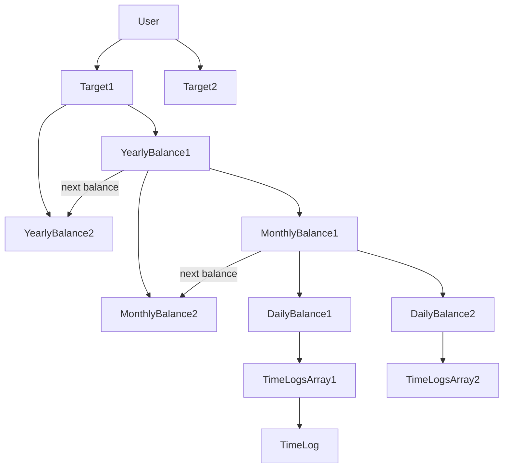
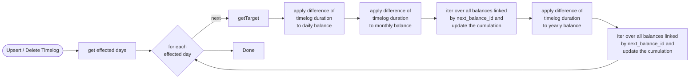
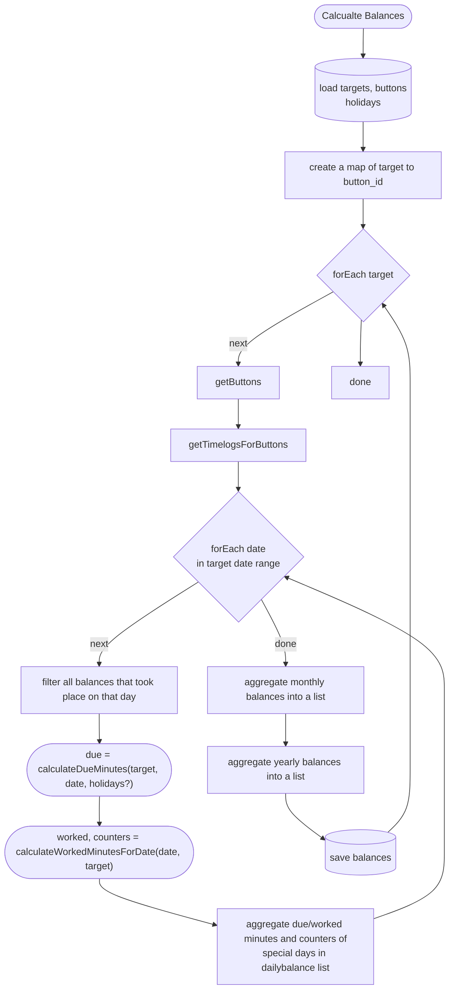
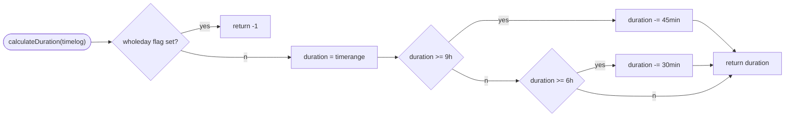

# Balance Calculations

Balances are calculated bottom up. All balances are from type Balance. Yearly, Monthly, Daily are stored in separate tables in the frontend. If any Object in a chain from bottom to User changes, propagate the change up to the respective target. No hashing, instead offer recalculation button. All balances are synced to backend to lower initial setup time after login in.

If a timelog spans midnight or multiple days, only the effective range is used. In other words: the time span is clipped for the specific date and breaks are only considered, if the log ends before the respective date ends. Breaks are applied ONCE per timelog based on total duration and applied only on the last day even if the duration from start of the day to end is less then the break duration.

Timezones should not be considered. If a work is done in a different timezone (see timelog timezone field), the timezone should be handled as being local time (work at 8:00am in berlin is the same as 8:00am in New York). All timestamps stored in UTC, displayed in user's local timezone. For calculation purposes, ignore timezone offset - treat as if local.

### Balance Data Structure

- id!
- user_id!
- target_id!
- next_balance_id? (null if last balance or daily balance, only same granularity allowed!)
- parent_balance_id? (null if yearly, else is the balance id of the upper level: daily -> monthly -> yearly)
- date (year for yearlybalance, year-month for monthlybalance, ...)
- due_minutes!
- worked_minutes!
- cumulative_minutes!
- sick_days!
- holidays! (no public holidays)
- business_trip!
- child_sick!
- worked_days! (all days excluding public holidays)
- created_at!
- updated_at!
- deleted_at

### Target Data Structure

- id!
- user_id!
- name!
- target_spec_ids[]
- created_at
- updated_at
- deleted_at

### Target Spec Structure

only used in the backend. the frontend gets a nested datastructure and therefore no created, updated, deleted timestamps are used by the frontend.

- id!
- user_id!
- target_id!
- starting_from!
- ending_at?
- duration_minutes[]
- weekdays[]
- exclude_holidays
- state_code
- created_at
- updated_at
- deleted_at

### Timelog Data Structure

- id!
- user_id!
- timer_id!
- type (normal, sick, holiday, business-trip, child-sick)
- whole_day!
- start_timestamp!
- end_timestamp?
- duration_minutes?
- timezone!
- apply_break_calcuation!
- notes?
- updated_at
- created_at
- month!
- year!
- deleted_at

### Upsert / Delete Timelog

The index db should have an index of date + target_id for efficient loading of affected days

### Minute Timer

To be as up to date as possible use a loop to trigger the update of active timelogs and propagate the due (only changes daily) and worked minutes (changes each minute). This should only happen when the balance is displayed to the user (e.g. history view).

### Init/recalculation of Balances

needs to process ALL timelogs for a target, since multiday targets can be effecting different balance objects. Important: does not calculate the total duration of a timelog. instead it extracts the effective duration from this timelog with respect to the balance timespan. this is done on upsert of the timelog. The aggregation for the next hierarchy level (daily, monthly, yearly) sums all balances by:

- cumulation of worked/due/cumulative minutes

  - for all special type counter values add the due minutes for that day to the worked minutes during the daily aggregation
    - e.g. sick_days = 1 and due_minutes=480 => worked_minutes += 480
  - cumulative minutes = worked - due + cumulation of previous month/year, this is set during the aggregation by sorting all balances by type and date
  - daily balances dont have cumulations
- sum of special type counters (e.g. sick, child_sick, holiday)

worked_days calculation:

- Increment for each day where worked_minutes > 0
- all specials except business_trip are excluded
- worked_days should be = days of the year - sick - child_sick - holiday - days not specified by the target (e.g. weekends, public holidays if exclude_holidays)

### Due Calcuation

### Worked Calculation for a specific date

### getEffectiveRange

### Timelog duration calculation

