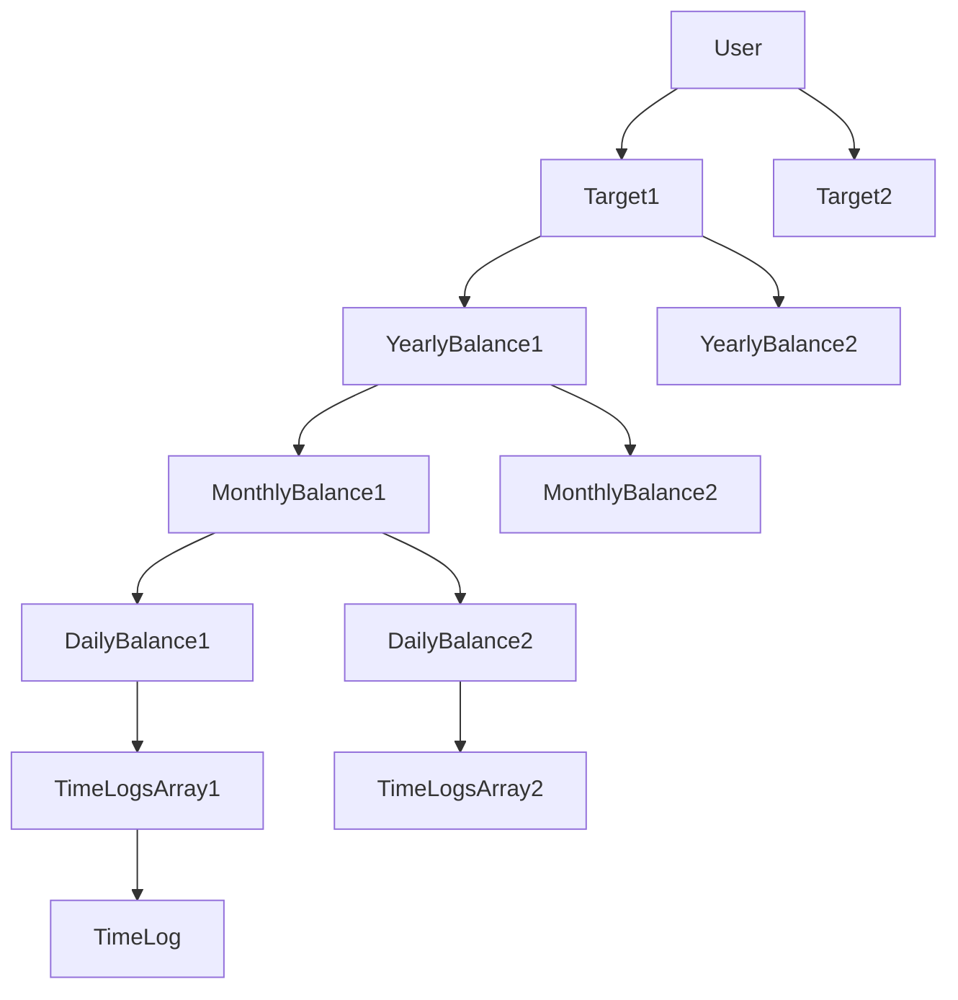
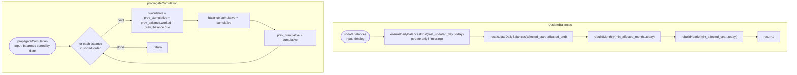
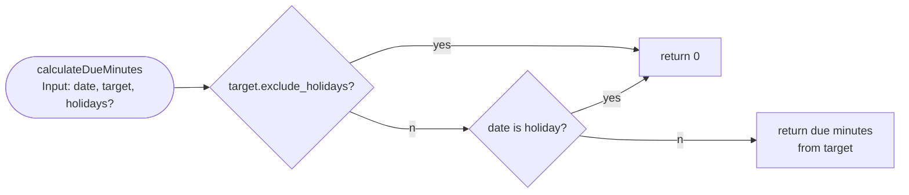
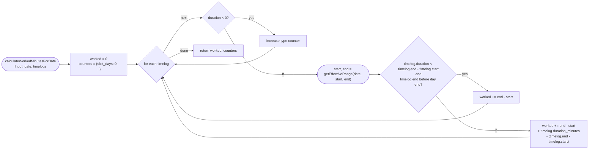
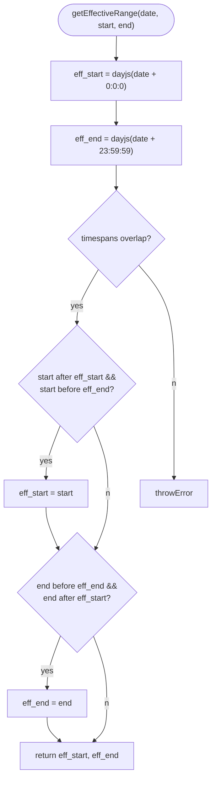

# Balance Calculations

Balances are calculated bottom up. All balances are from type Balance. Yearly, Monthly, Daily are stored in separate tables in the frontend. If any Object in a chain from bottom to User changes, propagate the change up to the respective target. No hashing, instead offer recalculation button. All balances are synced to backend to lower initial setup time after login in.

If a timelog spans midnight or multiple days, only the effective range is used. In other words: the time span is clipped for the specific date and breaks are only considered, if the log ends before the respective date ends. Breaks are applied ONCE per timelog based on total duration and applied only on the last day even if the duration from start of the day to end is less then the break duration.

Timezones should not be considered. If a work is done in a different timezone (see timelog timezone field), the timezone should be handled as being local time (work at 8:00am in berlin is the same as 8:00am in New York). All timestamps stored in UTC, displayed in user's local timezone. For calculation purposes, ignore timezone offset - treat as if local.

### Balance Data Structure

- id! (composite key: `{target_id}_{date}`, e.g., `uuid_2025-01-15`)
- user_id!
- target_id!
- date (year for yearlybalance, year-month for monthlybalance, ...)
- due_minutes!
- worked_minutes!
- cumulative_minutes!
- sick_days!
- holidays! (no public holidays)
- business_trip!
- child_sick!
- worked_days! (all days excluding public holidays)
- created_at!
- updated_at!
- deleted_at

**Note**: The `id` is a composite key combining `target_id` and `date`, making it deterministic and derivable. The `next_balance_id` field has been removed as cumulation propagation now uses sorted date order instead of linked-list traversal.

### Target Data Structure

- id!
- user_id!
- name!
- target_spec_ids[]
- created_at
- updated_at
- deleted_at

### Target Spec Structure

only used in the backend. the frontend gets a nested datastructure and therefore no created, updated, deleted timestamps are used by the frontend.

- id!
- user_id!
- target_id!
- starting_from!
- ending_at?
- duration_minutes[] (7-entry array for Sun-Sat, indices 0-6)
- exclude_holidays
- state_code
- created_at
- updated_at
- deleted_at

### Timelog Data Structure

- id!
- user_id!
- timer_id!
- type (normal, sick, holiday, business-trip, child-sick)
- whole_day!
- start_timestamp!
- end_timestamp?
- duration_minutes?
- timezone!
- apply_break_calcuation!
- notes?
- updated_at
- created_at
- month!
- year!
- deleted_at

### Minute Timer

To be as up to date as possible use a loop to trigger the update of active timelogs and propagate the due (only changes daily) and worked minutes (changes each minute). This should only happen when the balance is displayed to the user (e.g. history view).

### Init/recalculation of Balances

Balances are still calculated bottom-up (daily -> monthly -> yearly), but we introduce a small metadata structure stored in local storage to avoid recalculating ranges that are known to be up to date.

#### Balance Calc Metadata (local storage)

Store a per-user, per-target marker for the last *day* for which balances are fully derived and propagated.

- key: `balance_calc_meta_v1`
- value:

  - `schema_version: 1`
  - `user_id: string`
  - `targets: Record<target_id, { last_updated_day: string /* YYYY-MM-DD */, updated_at: string /* ISO */ }>`

Notes:

- `last_updated_day` refers to the *daily* balance layer being present and correct up to that date, and higher layers derived at least up to the same date.
- When conflicts occur during sync (or when data is cleared), this metadata should be cleared for the affected target(s).
- The metadata does not replace correctness guarantees: if inputs change in the past, affected ranges still need recomputation (see “Update Balances on Timelog change”).

#### Initial calculation / full recalculation

The initial calculation should start at the earliest date derived from the target specs and iterate day-by-day to first create/update all daily balances. Then, after daily balances exist for the whole range, derive monthly and yearly entries.

Algorithm (per target):

1. Determine the calculation range:
   - `range_start = min(targetSpec.starting_from)`
   - `range_end = min(targetSpec.ending_at, today)` (inclusive)
2. Iterate all days from `range_start` to `range_end`:
   - compute due minutes from the applicable target spec + holiday rules
   - compute worked minutes for that date by aggregating effective durations of timelogs overlapping that date
   - **upsert** the daily balance using deterministic id (`{target_id}_{YYYY-MM-DD}`)
3. Derive monthly balances:
   - group daily balances by month
   - sum due/worked + counters
   - compute monthly `cumulative_minutes` by sorting months and applying rolling cumulation
4. Derive yearly balances:
   - group monthly or daily by year (either is fine if consistent)
   - sum due/worked + counters
   - compute yearly `cumulative_minutes` by sorting years and applying rolling cumulation
5. Update metadata:
   - set `last_updated_day = range_end`

Multi-day timelogs still need special handling: we do not “split” the timelog into multiple records; instead we clip it per day (see `getEffectiveRange`) and apply the break subtraction rule only once (on the last day).

Important: does not calculate the total duration of a timelog. instead it extracts the effective duration from this timelog with respect to the balance timespan. this is done on upsert of the timelog. The aggregation for the next hierarchy level (daily, monthly, yearly) sums all balances by:

- cumulation of worked/due/cumulative minutes

  - for all whole day timelogs, add the due minutes for that day to the worked minutes during the daily aggregation
    - e.g. sick_days = 1 and due_minutes=480 => worked_minutes += 480
  - cumulative minutes = (worked - due + cumulation) of previous month/year, this is set during the aggregation by sorting all balances by type and date. This field is needed for displaying the monthly balance. When showing a balance, the actual balance can be recalculated by the current worked and due minutes + the cumulation field which is the cumulation of all past event to this balance entry.
  - daily balances dont have cumulations
- sum of special type counters (e.g. sick, child_sick, holiday)

worked_days calculation:

- Increment for each day where worked_minutes > 0
- all specials except business_trip are excluded
- worked_days should be = days of the year - sick - child_sick - holiday - days not specified by the target (e.g. weekends, public holidays if exclude_holidays)

### Update Balances on Timelog change

Routine to update balances without doing all the math when one timelog changes.

Key change: use the same bottom-up algorithm as the initial calculation, but only *create* daily balances when they don’t exist yet. Existing daily balances are considered authoritative unless the timelog change affects their day.

1) Determine affected date range:

- `affected_start = date(start_timestamp)`
- `affected_end = date(end_timestamp ?? start_timestamp)`
- If a timelog crosses midnight, all days in-between are affected.

2) Ensure daily layer exists up to today (incremental extension):

- Read metadata `last_updated_day` for the target.
- If `last_updated_day < today`, iterate `d = last_updated_day + 1 .. today`:
  - **if daily balance for `d` does not exist**: create it (compute due/worked/counters)
  - **if it exists**: do nothing (no recalculation)
- After this step, set `last_updated_day = today`.

3) Recalculate only truly affected daily balances:

- For each day in `affected_start..affected_end`:
  - recompute daily due/worked/counters from source-of-truth inputs (timelogs, target specs, holidays)
  - upsert daily balance

4) Re-derive higher levels for the minimal impacted ranges:

- Determine impacted months/years from `affected_start..today` (because cumulative fields depend on history order).
- Rebuild monthly balances for impacted months by summing daily balances.
- Recompute monthly `cumulative_minutes` starting from the earliest impacted month.
- Rebuild yearly balances for impacted years by summing monthly (or daily) balances.
- Recompute yearly `cumulative_minutes` starting from the earliest impacted year.

Note: if you store `cumulative_minutes` on monthly/yearly entries, any change in the past potentially affects all later cumulative values. That’s why the propagation range is `min(impacted_period)..today`.

## Suggestions to speed things up (and improve caching)

1. **Index timelogs by day (local) for fast daily aggregation**

- Maintain a local map/table: `timelog_day_index(date -> timelog_ids[])`.
- Update it on timelog upsert/delete.
- Then `calculateWorkedMinutesForDate` doesn’t need to scan every timelog; it can load only the small set overlapping that day.

2. **Persist a normalized “effective slices per day” cache for multi-day timelogs**

- For each timelog, store computed effective minutes per day in a small local table keyed by `(timelog_id, date)`.
- On timelog change, recompute only those days.
- Daily worked aggregation becomes a simple sum over slices.

4) **Propagate cumulation only from the earliest changed period**

- When rebuilding monthly/yearly, determine the earliest period that changed (first month where sums differ or first month in affected range).
- Recompute `cumulative_minutes` only from there forward.

5) **Precompute holiday lookup**

- Create a `Set<string>` of holiday `YYYY-MM-DD` per year (or per target if exclude rules differ).
- Avoid repeated “is holiday” DB lookups inside daily loops.

6) **Chunking + yielding in the UI**

- The initial day-by-day iteration can be chunked (e.g. 30/60 days at a time) and yielded (microtask/`requestIdleCallback`) to keep the UI responsive.
- Persist intermediate progress and update `last_updated_day` only when a chunk is fully done.

### Due Calcuation

### Worked Calculation for a specific date

### getEffectiveRange

### Timelog duration calculation

